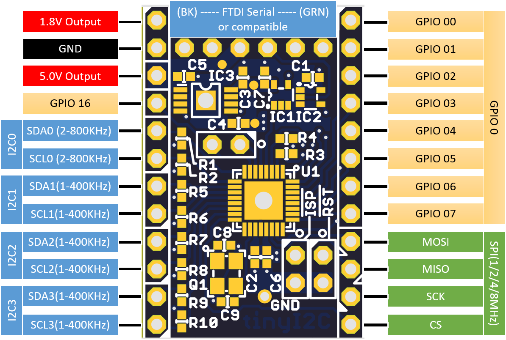

tinyI2C
=======

## What is this?
This is a tiny UART-I2C converter software/hardware project using mbed conpatible microcontrollers.
The module converts UART command packets into I2C/SPI protocol or GPIO to read/write with
configurable pull-up/pull-down modes.

- the "FTDI" USB-UART cable to connect to host PC; from PC the module look only an USB-Serial port
  - up to 115200 boudrate UART to communicate
- up to 4 channel I2C ports with selectable speed
- one SPI port with 8/16 bits word, also selectable speed
- up to 2 x 8bit, General Purpose IO ports

- tinyI2C       <-- root
  - gui       <-- PyQt4 based GUI source codes  
  - mbed      <-- mbed source codes  
  - pcb       <-- PCB design files for eagle  
  - python    <-- python module code with standalone test program  

## Requirement
- Python 2.7  
  `apt-get install python`
- PySerial  
  `pip install pyserial`
* mbed microcontrollers using LPC824(recommended)/LPC1768/LPC11U24/LPC11U35  
  see [mbed.org](developer.mbed.org)

## Install
1. install python 2.7 on your PC
2. install PySerial
3. (Windows only) if you use LpcXpresso 824 then install [mbed Serial port driver](http://developer.mbed.org/handbook/Windows-serial-configuration)

## Usage
1. write mbed program into your mbed
2. connect mbed to PC via Serial port
3. start gui software
4. select Serial port from dropdown list
5. you will be able to use up to 4 channels of I2C slaves and more!
    * check PinOut for your usage! 

## Demo
  try `python/tinyI2C.py`

## Command set and protocol
the command packet starts/ends with few number of characters: for starting(head)
character there are several choices but ending(tail) is always `'P'`, 0x50 in hex.
this command character as well as packet structure is inspired(some copied) from NXP Semiconductor's
UART-I2C converter/controller, named **SC18IM700**.

### I2C
* `'S'` 0x53 I2C-bus START  
* `'P'` 0x50 I2C-bus STOP

|head |slave address(W) |data length  |binary data to write       |tail |
|:---:|:---:            |:---:        |:---:                      |:---:|
| S   | 0x_8 _0         | 0x_0 _4     | 0x_D _E _A _D _B _E _A _F | P   |

|head |slave address(R\)|data length  |tail |
|:---:|:---:            |:---:        |:---:|
| S   | 0x_8 _1         | 0x_0 _4     | P   |

|head |slave address  |data length  |binary data to write       |repeated start |slave address    |data length  |tail |
|:---:|:---:          |:---:        |:---:                      |:---:          |:---:            |:---:        |:---:|
| S   | 0x_8 _0       | 0x_0 _4     | 0x_D _E _A _D _B _E _A _F | S             | 0x_8 _1         | 0x_0 _4     | P   |

* `'C'` 0x43 change channel

|head |channel  |tail |
|:---:|:---:    |:---:|
| C   | 0       | P   |
| C   | 1       | P   |
| C   | 2       | P   |
| C   | 3       | P   |

- you can select I2C channel by sending `'C'` and channel number `'0'`to`'3'` with tail char.
- the protocol starts from `'S'`, which makes start condition on I2C bus, followed by 7bit I2C slave address and read(1)/write(0) command bit and,
  - to *Write* data into slave device: send data length to write(1~255) and actual data
  - to *Read* data from slave device: send data length to read(1~255)
- ends with sending `'P'` which makes stop condition on the bus, and return depends on command:
  - *Read*: actual binary data ending by `OK`
  - *Write*: `"ACK"` or `"NAK"` depends on response from slave and `"OK"`

### SPI
* [\_] E 0x45 SPI transfer start
### GPIO
### internal registers(speed setting etc.)
### [X] R 0x52 read SC18IM700 internal register
### [X] W 0x57 write to SC18IM700 internal register
### [\_] I 0x49 read GPIO port
### [\_] O 0x4F write to GPIO port
### [\_] Z 0x5A power down

## Contribution by
Kazuki Yamamoto ( <k.yamamoto.08136891@gmail.com> )

## License
- [CC-BY-SA] (http://creativecommons.org/licenses/by-sa/4.0/legalcode)
- [CC-BY-SA 日本語](http://creativecommons.org/licenses/by-sa/2.1/jp/legalcode)

## Author

[K4zuki](https://github.com/K4zuki)
