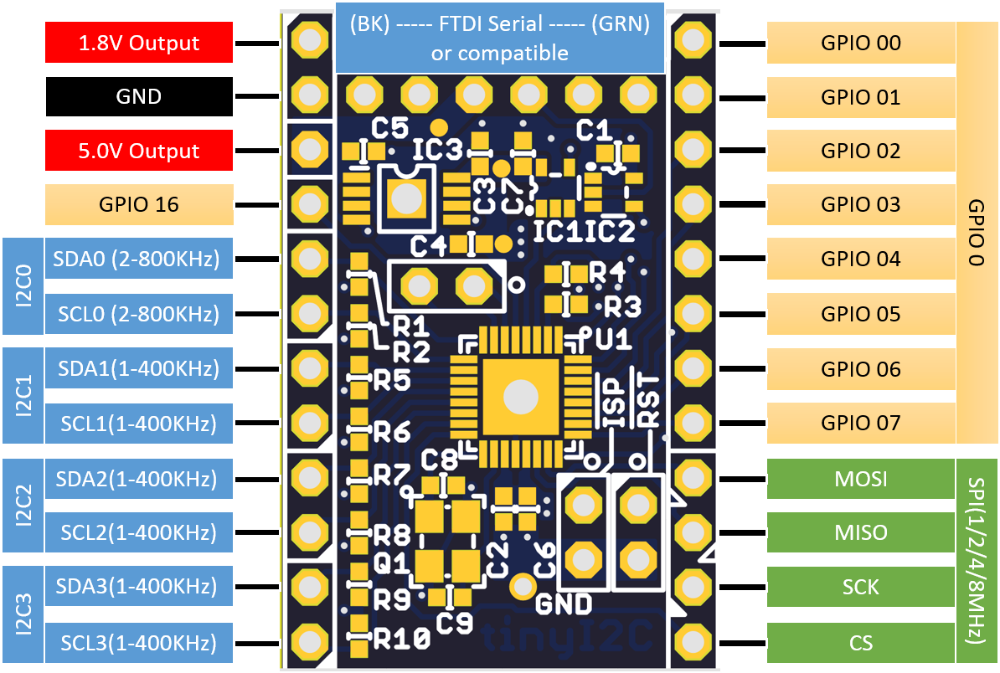

tinyI2C{-}
=======

This is a tiny UART-I2C converter software/hardware project using mbed conpatible microcontrollers.
The module converts UART command packets into I2C/SPI protocol or GPIO to read/write with
configurable pull-up/pull-down modes.

- the "FTDI" USB-UART cable to connect to host PC; from PC the module look only an USB-Serial port
    - up to 115200 boudrate UART to communicate
- up to 4 channel I2C ports with selectable speed
- one SPI port with 8/16 bits word, also selectable speed
- up to 2 x 8bit, General Purpose IO ports

- tinyI2C       <-- root
    - gui       <-- PyQt4 based GUI source codes
    - mbed      <-- mbed source codes
    - pcb       <-- PCB design files for eagle
    - python    <-- python module code with standalone test program

# Requirement
- Python 2.7
  `apt-get install python`
- PySerial
  `pip install pyserial`
* mbed microcontrollers using LPC824(recommended)/LPC1768/LPC11U24/LPC11U35
  see [mbed.org](developer.mbed.org)

# Install
1. install python 2.7 on your PC
2. install PySerial
3. (Windows only) if you use LpcXpresso 824 then install [mbed Serial port driver](http://developer.mbed.org/handbook/Windows-serial-configuration)

# Usage
1. write mbed program into your mbed
2. connect mbed to PC via Serial port
3. start gui software
4. select Serial port from dropdown list
5. you will be able to use up to 4 channels of I2C slaves and more!
    * check PinOut for your usage! 

# Demo
  try `python/test.py`

## Demo GUI
GUI source codes placed in `gui/` which requires compilation
 (for now, _do it yourself_ basis).

GUI setup requires:
- PyQT4
- pyinstaller

### Compile GUI
On project root,
```
$ make gui
```

### Run GUI
On project root,
```
$ dist/TinyI2C
```

# Command set and protocol
- _this command character as well as packet structure is inspired(some copied) from
NXP Semiconductor's UART-I2C converter/controller, named **SC18IM700**._

- the command packet starts/ends with few number of characters: for starting(`head`)
character there are several choices but ending(`tail`) is always `'P'`, 0x50 in hex.
    - if only sending 'P', `tinyI2C` makes stop condition pulse (**without start condition**)
  on currently selected I2C bus and returns "ok" return packet.
- the `tinyI2C` watches its UART port \_Forever until_ it receives `tail`
  and counts received packet length by bytes (`plength`).
  then searches first character of the packet whether if matches one of registered `head` character.
    - if it does not match with any of valid `head` the device returns
  "command is not implemented" return packet.
- if valid head found it checks `plength-2` which is actual data packet length.
    - if you send an invalid packet, the device returns "bad packet" return packet.

## I2C
### `'S'` 0x53 I2C-bus START
### `'P'` 0x50 I2C-bus STOP, end of packet
- the protocol starts from `'S'`, which makes start condition on I2C bus, followed by 7bit I2C slave address and read(1)/write(0) command bit and,
  - to *Write* data into slave device: send data length to write(1~255) and actual data
  - to *Read* data from slave device: send data length to read(1~255)
- ends with sending `'P'` which makes stop condition on the bus
- return packet depends on command:
  - first, `"ACK"` or `"NAK"` depends on response from slave
  - *Read*: read data in hex sting (0xAA -> "AA") separated by ',' and ends by `ok`
  - *Write*: `ok`


- command packet: write 4 bytes to slave at 0x80(8bit)

| head  | slave address(W) | data length |          binary data to write           | tail  |
|:-----:|:----------------:|:-----------:|:---------------------------------------:|:-----:|
|   S   |    0x\_8 \_0     |  0x\_0 \_4  |    0x_D \_E \_A \_D \_B \_E \_A \_F     |   P   |
| `'S'` |      `'80'`      |   `'04'`    |              `'=>:=;>:?'`               | `'P'` |
| 0x53  |    0x38 0x30     |  0x30 0x34  | 0x3D 0x3E 0x3A 0x3D 0x3B 0x3E 0x3A 0x3F | 0x50  |

- return packet

| result | head  | delimiter | tail |
|:------:|:-----:|:---------:|:----:|
| sucess | "ACK" |     ,     | "ok" |
|  fail  | "NAK" |     ,     | "ok" |

- command packet: read 4 bytes from slave at 0x80(8bit)

| head | slave address(R\) | data length | tail |
|:----:|:-----------------:|:-----------:|:----:|
|  S   |     0x\_8 \_1     |  0x\_0 \_4  |  P   |

- return packet

| result | head  | delimiter |               data                | tail |
|:------:|:-----:|:---------:|:---------------------------------:|:----:|
| sucess | "ACK" |     ,     | actual data: "AA","BB","CC","DD", | "ok" |
|  fail  | "NAK" |     ,     | dummy data: "C4","FE","E0","CA",  | "ok" |

- command packet: write and read 4 bytes to/from slave at 0x80(8bit)

| head | slave address(W) | data length |       binary data to write       | repeated start | slave address(R\) | data length | tail |
|:----:|:----------------:|:-----------:|:--------------------------------:|:--------------:|:-----------------:|:-----------:|:----:|
|  S   |    0x\_8 \_0     |  0x\_0 \_4  | 0x_D \_E \_A \_D \_B \_E \_A \_F |       S        |     0x\_8 \_1     |  0x\_0 \_4  |  P   |

- return packet

| result | head  | delimiter |               data                | tail |
|:------:|:-----:|:---------:|:---------------------------------:|:----:|
| sucess | "ACK" |     ,     | actual data: "AA","BB","CC","DD", | "ok" |
|  fail  | "NAK" |     ,     | dummy data: "C4","FE","E0","CA",  | "ok" |

### `'C'` 0x43 change channel
- you can select I2C channel by sending `'C'` and channel number `'0'`to`'3'` with `tail` char.

| head | channel | tail |
|:----:|:-------:|:----:|
|  C   |   '0'   |  P   |
|  C   |   '1'   |  P   |
|  C   |   '2'   |  P   |
|  C   |   '3'   |  P   |

## SPI
### `'E'` 0x45 SPI transfer start

- minimum plength=8

| head | data length(W) | data length(R\) | binary data to write | tail |
|:----:|:--------------:|:---------------:|:--------------------:|:----:|
|  E   |   0x\_0 \_1    |    0x\_0 \_0    |      0x\_D \_E       |  P   |

- minimum plength=10(16bit)

| head | data length(W) | data length(R\) | binary data to write | tail |
|:----:|:--------------:|:---------------:|:--------------------:|:----:|
|  E   |   0x\_0 \_1    |    0x\_0 \_0    |   0x_D \_E \_A \_D   |  P   |

- write and read

| head | data length(W) | data length(R\) |       binary data to write       | tail |
|:----:|:--------------:|:---------------:|:--------------------------------:|:----:|
|  E   |   0x\_0 \_4    |    0x\_0 \_4    | 0x_D \_E \_A \_D \_B \_E \_A \_F |  P   |

<!--
~~~
/*
"0|   1   2|   3   4|   5   6  7  8  9 10 11 12|13" //plength=14
"E| 0x\_0 \_1| 0x\_0 \_0| 0x_D \_E| P"                   //minimum plength=8
"E| 0x\_0 \_1| 0x\_0 \_0| 0x_D \_E|_A \_D| P"             //minimum plength=10(16bit)
"E| 0x\_0 \_4| 0x\_0 \_0| 0x_D \_E \_A \_D \_B \_E \_A \_F| P" //write
"E| 0x\_0 \_4| 0x\_0 \_4| 0x_D \_E \_A \_D \_B \_E \_A \_F| P" //write and read
*/
~~~
-->

## GPIO
This is a subset of [R/W commands](#internal-registers); only access GPIO's status registers.

### `'I'` 0x49 read GPIO port register
### `'O'` 0x4F write to GPIO port register

| head | GPIO | tail |
|:----:|:----:|:----:|
|  I   | '0'  |  P   |
|  I   | '1'  |  P   |

| head | GPIO |   data    | tail |
|:----:|:----:|:---------:|:----:|
|  O   | '0'  | 0x\_A \_A |  P   |
|  O   | '1'  | 0x\_A \_A |  P   |

| register | name in python | purpose          |
|:--------:|:--------------:|:-----------------|
|    0     |   GPIO0_STAT   | status of GPIO 0 |
|    1     |   GPIO1_STAT   | status of GPIO 1 |

## Internal registers
### `'R'` 0x52 read internal register
### `'W'` 0x57 write to internal register
- single register read

| head | register | tail |
|:----:|:--------:|:----:|
|  R   |   '0'    |  P   |
|  R   |   '1'    |  P   |

- multi registers read

| head | register(1) | register(2) | ... | register(n) | tail |
|:----:|:-----------:|:-----------:|:---:|:-----------:|:----:|
|  R   |     '0'     |     '1'     | ... |     '5'     |  P   |
|  R   |     '1'     |     '0'     | ... |     '9'     |  P   |

- return packet's order is same as command packet's order

: multi registers write

| head | register(1) | register data (1) | register(2) | register data (2) | ... | register(n) | register data (n) | tail |
|:----:|:-----------:|:-----------------:|:-----------:|:-----------------:|:---:|:-----------:|:-----------------:|:----:|
|  W   |     '0'     |     0x\_A \_A     |     '1'     |     0x\_A \_B     | ... |     '5'     |     0x\_A \_D     |  P   |
|  W   |     '1'     |     0x\_A \_A     |     '0'     |     0x\_A \_B     | ... |     '9'     |     0x\_A \_D     |  P   |

- return packet's order is same as command packet's order

| register | name in python | purpose                              |
|:--------:|:--------------:|:-------------------------------------|
|    0     |    CHIP_ID     | converter's chip ID                  |
|    1     |   GPIO0_STAT   | status of GPIO 0                     |
|    2     |   GPIO1_STAT   | status of GPIO 1                     |
|    4     |   GPIO1_CONF   | GPIO 0 IO configuration              |
|    3     |   GPIO0_CONF   | GPIO 1 IO configuration              |
|    5     |    I2C_CONF    | I2C channel 1~4 speed configuration  |
|    6     |    SPI_CONF    | SPI speed and polarity configuration |

| register 0  | command | CHIP_ID                    |
|:-----------:|:-------:|:---------------------------|
| [7\.\.\.0\] |   R/W   | returns chip ID character: |
|             |         | '0'- LPC824                |
|             |         | '1'- LPC1768               |
|             |         | '2'- LPC11U24 or LPC11U35  |

| register 1  | command | GPIO0_STAT                                                          |
|:-----------:|:-------:|:--------------------------------------------------------------------|
| [7\.\.\.0\] |    R    | behavior changes depend on corresponding bit of GPIO0_CONF register |
|             |         | 1: reads output setting                                             |
|             |         | 0: reads input of the pin                                           |
|             |    W    | behavior changes depend on corresponding bit of GPIO0_CONF register |
|             |         | 1: writes data to the pin                                           |
|             |         | 0: do nothing                                                       |

| register 2  | command | GPIO1_STAT                                                           |
|:-----------:|:-------:|:---------------------------------------------------------------------|
|             |         | **if GPIO1 is not enabled, access to this register will be ignored** |
| [7\.\.\.0\] |    R    | behavior changes depend on corresponding bit of GPIO1_CONF register  |
|             |         | 1: reads output setting                                              |
|             |         | 0: reads input of the pin                                            |
|             |    W    | behavior changes depend on corresponding bit of GPIO1_CONF register  |
|             |         | 1: writes data to the pin                                            |
|             |         | 0: do nothing                                                        |

| register 3  | command | GPIO0_CONF                                                                                    |
|:-----------:|:-------:|:----------------------------------------------------------------------------------------------|
| [7\.\.\.0\] |    R    | Reads each pin's Input/Output conditions:                                                     |
|             |         | 1 = the pin is set to output                                                                  |
|             |         | 0 = the pin is set to input with internal pullup                                              |
|             |    W    | Sets each pin's Input/Output configurations:                                                  |
|             |         | 1: sets the pin to an Output. output level is set by corresponding bit of GPIO0_STAT register |
|             |         | 0: sets the pin to an Input with internal pull-up connected                                   |

| register 4  | command | GPIO1_CONF                                                                                    |
|:-----------:|:-------:|:----------------------------------------------------------------------------------------------|
|             |         | **if GPIO1 is not enabled, access to this register will be ignored**                          |
| [7\.\.\.0\] |    R    | Reads each pin's Input/Output conditions:                                                     |
|             |         | 1: the pin is set to output                                                                   |
|             |         | 0: the pin is set to input with internal pullup                                               |
|             |    W    | Sets each pin's Input/Output configurations:                                                  |
|             |         | 1: sets the pin to an Output. output level is set by corresponding bit of GPIO1_STAT register |
|             |         | 0: sets the pin to an Input with internal pull-up connected                                   |

| register 5  | command | I2C_CONF                                                                                                    |
|:-----------:|:-------:|:------------------------------------------------------------------------------------------------------------|
| [7\.\.\.6\] |   R/W   | Read/Write clock configuration of I2C1                                                                      |
|             |         | 11: I2C1 is set to operate in 800kHz clock                                                                  |
|             |         | 10: I2C1 is set to operate in 600kHz clock                                                                  |
|             |         | 01: I2C1 is set to operate in 400kHz clock                                                                  |
|             |         | 00: I2C1 is set to operate in 200kHz clock                                                                  |
| [5\.\.\.4\] |         | Read/Write clock configuration of I2C2; **if I2C2 is not enabled, access to this bitfield will be ignored** |
|             |         | 11: I2C2 is set to operate in 400kHz clock                                                                  |
|             |         | 10: I2C2 is set to operate in 300kHz clock                                                                  |
|             |         | 01: I2C2 is set to operate in 200kHz clock                                                                  |
|             |         | 00: I2C2 is set to operate in 100kHz clock                                                                  |
| [3\.\.\.2\] |         | Read/Write clock configuration of I2C3; **if I2C3 is not enabled, access to this bitfield will be ignored** |
|             |         | 11: I2C3 is set to operate in 400kHz clock                                                                  |
|             |         | 10: I2C3 is set to operate in 300kHz clock                                                                  |
|             |         | 01: I2C3 is set to operate in 200kHz clock                                                                  |
|             |         | 00: I2C3 is set to operate in 100kHz clock                                                                  |
| [1\.\.\.0\] |         | Read/Write clock configuration of I2C4; **if I2C4 is not enabled, access to this bitfield will be ignored** |
|             |         | 11: I2C4 is set to operate in 400kHz clock                                                                  |
|             |         | 10: I2C4 is set to operate in 300kHz clock                                                                  |
|             |         | 01: I2C4 is set to operate in 200kHz clock                                                                  |
|             |         | 00: I2C4 is set to operate in 100kHz clock                                                                  |

| register 6  | command | SPI_CONF                                  |
|:-----------:|:-------:|:------------------------------------------|
|    [7\]     |   R/W   | Not used                                  |
| [6\.\.\.4\] |         | Read/Write clock configuration of SPI     |
|             |         | 111: SPI is set to operate in 8MHz clock  |
|             |         | 110: SPI is set to operate in 7MHz clock  |
|             |         | ...                                       |
|             |         | 001: SPI is set to operate in 2MHz clock  |
|             |         | 000: SPI is set to operate in 1MHz clock  |
|    [3\]     |         | Reads/Wreite polarity of CE print         |
|             |         | 1: CE is set to HIGH-active               |
|             |         | 0: CE is set to LOW-active                |
|    [2\]     |         | Read/Write word size setting of SPI       |
|             |         | 1: 16 bit word                            |
|             |         | 0: 8 bit word                             |
| [1\.\.\.0\] |         | Read/Write SPI mode                       |
|             |         | 11: SPI is set to operate in clock mode 3 |
|             |         | 10: SPI is set to operate in clock mode 2 |
|             |         | 01: SPI is set to operate in clock mode 1 |
|             |         | 00: SPI is set to operate in clock mode 0 |

# Contribution by
Kazuki Yamamoto ( <k.yamamoto.08136891@gmail.com> )

# License
- [CC-BY-SA](http://creativecommons.org/licenses/by-sa/4.0/legalcode)
- [CC-BY-SA 日本語](http://creativecommons.org/licenses/by-sa/2.1/jp/legalcode)

# Author

[K4zuki](https://github.com/K4zuki)
